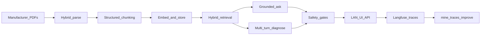
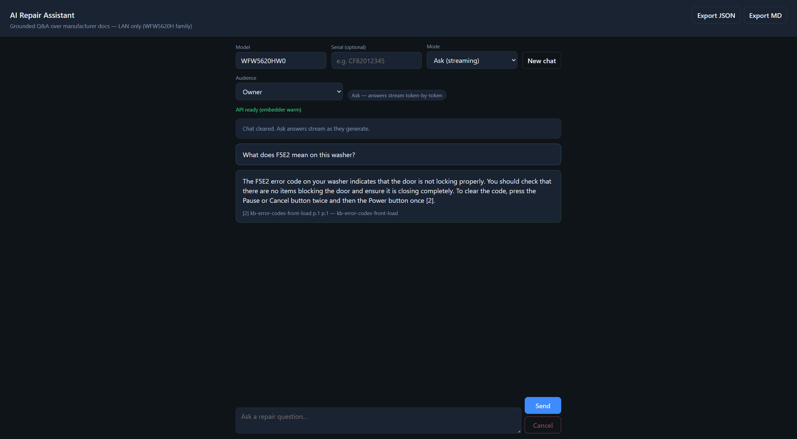
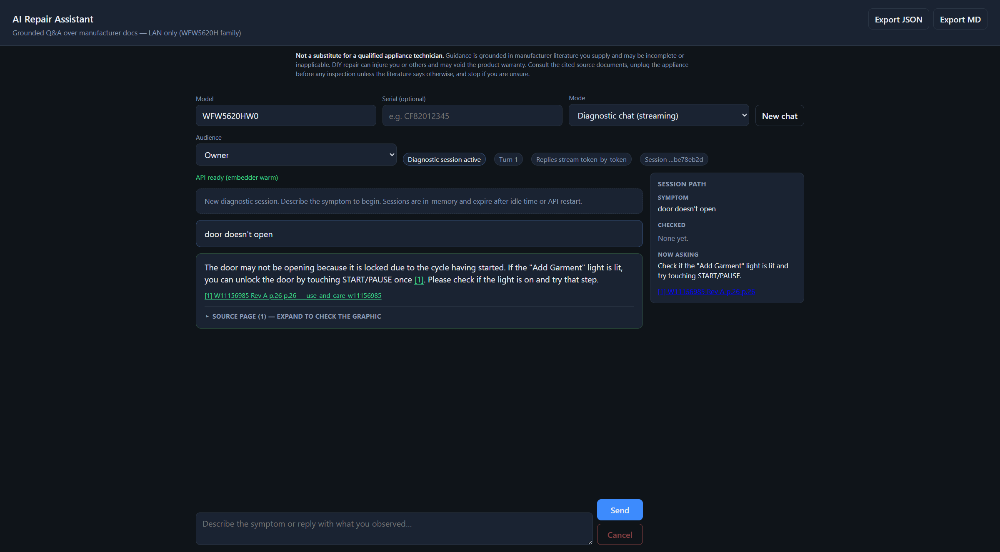
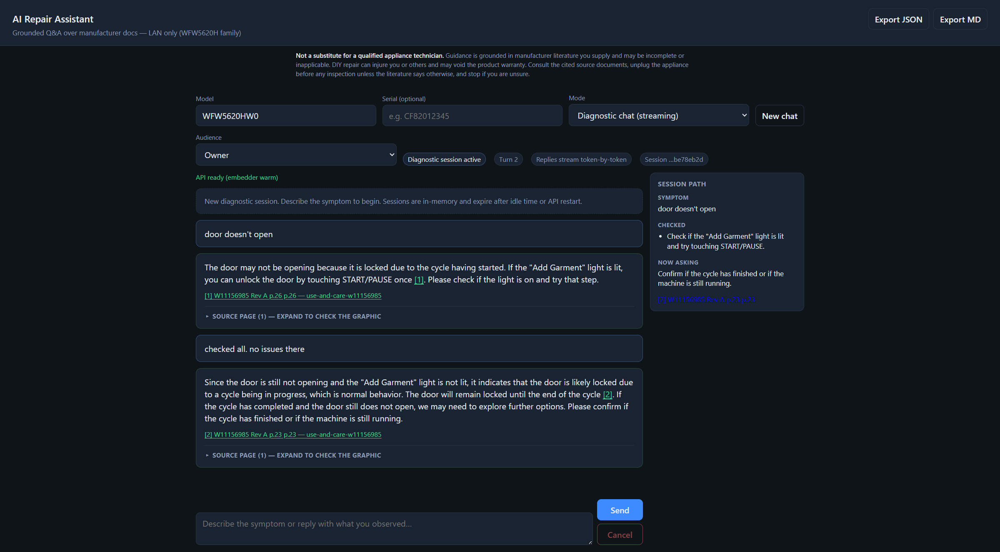
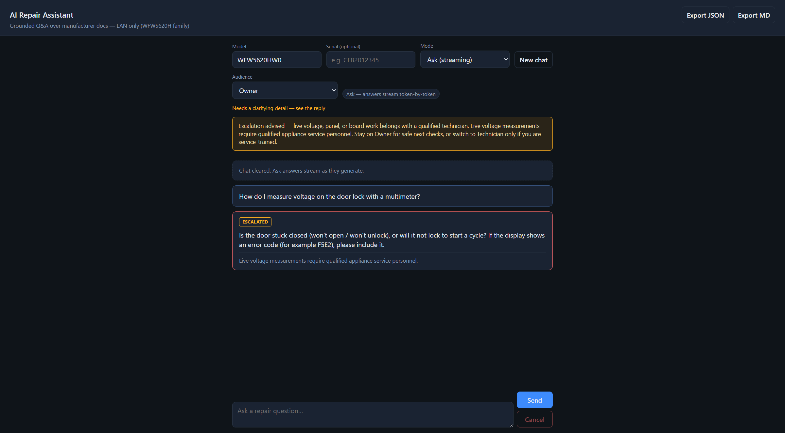
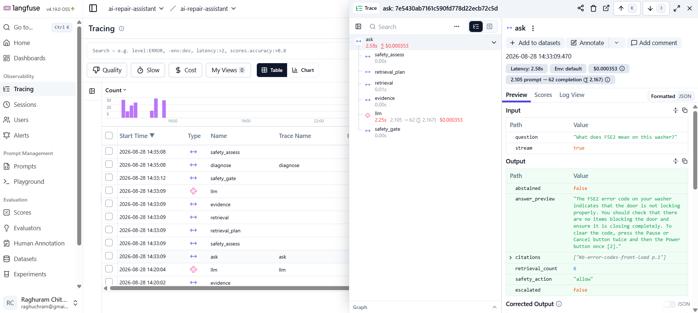

# AI Repair Assistant

Appliance repair needs **authoritative manufacturer knowledge**, not generic LLM advice.
This is a self-hostable framework for **grounded ask** and **multi-turn diagnose** over your
own service manuals and tech sheets — with numbered citations, model/serial applicability
filters, and deterministic safety gates before answers reach the user.

It was proven end-to-end on a **Whirlpool front-load washer reference corpus**
(WFW5620H / WFW5620HW0). The application code is reusable; PDFs stay out of git and
you supply the brand-specific manifest and documents. See
[Reference corpus build](docs/REFERENCE_CORPUS_BUILD.md) to reproduce that setup.

> **Phase 11 complete.** LAN-only deployment ([charter](docs/CHARTER.md), constraint D8).
> Web UI at `http://localhost:8080/ui` after [Deployment](docs/DEPLOYMENT.md).
> Optional [Langfuse](docs/LANGFUSE.md) traces; `mine-traces` drafts evals from live failures
> ([ADR-0023](docs/adr/0023-trace-driven-eval-mining.md)).

---

## How we built it

Each pipeline layer went through the same loop: **charter phase → measure → ADR → implement → bench** — not “ship prompts and hope.”

| Experiment | Outcome |
| --- | --- |
| Parser bake-off | pdfplumber + structured table rows ([ADR-0007](docs/adr/0007-parser-and-chunker.md)); later hybrid layout routing ([ADR-0024](docs/adr/0024-hybrid-parse-architecture.md)) |
| Retrieval arms | Hybrid re-test kept the product gate at 14/14 hard ([ADR-0010](docs/adr/0010-retrieval-applicability.md), [ADR-0020](docs/adr/0020-hybrid-retrieval-retest.md)) |
| Safety | Deterministic allow / warn / escalate / block — not LLM-only ([ADR-0014](docs/adr/0014-safety-policy.md)) |
| Traces → evals | Langfuse spans mined into human-reviewed draft scenarios ([ADR-0018](docs/adr/0018-langfuse-observability.md), [ADR-0023](docs/adr/0023-trace-driven-eval-mining.md)) |

Full decision log: [Architecture decision records](docs/adr/README.md).
Manual benches at every layer: [Evaluation](docs/EVALS.md).

---

## Capabilities by pipeline layer



- **Parsing** — hybrid page router, matrix vs multi-column, quality overrides ([ADR-0024](docs/adr/0024-hybrid-parse-architecture.md))
- **Chunking** — table-row / matrix / contextual enrichment ([ADR-0007](docs/adr/0007-parser-and-chunker.md), [ADR-0022](docs/adr/0022-contextual-chunk-enrichment.md))
- **Retrieval** — vector + codes/connectors, applicability, owner-preferring literature when feasible ([ADR-0010](docs/adr/0010-retrieval-applicability.md))
- **Grounded Q&A / diagnose** — citations, abstain, checklist path discipline ([ADR-0012](docs/adr/0012-grounded-qa.md), [ADR-0013](docs/adr/0013-langgraph-diagnostic.md))
- **Safety** — block / escalate / post-LLM gates; owner vs technician ([ADR-0014](docs/adr/0014-safety-policy.md))
- **Improve from traces** — Langfuse → `mine-traces` reports → human promote ([ADR-0018](docs/adr/0018-langfuse-observability.md), [ADR-0023](docs/adr/0023-trace-driven-eval-mining.md))

**Architecture (drill-down):** [System context](docs/architecture/01-system-context.md) · [Deployment](docs/architecture/02-deployment.md) · [Offline ingest](docs/architecture/03-offline-ingest.md) · [Retrieval](docs/architecture/04-retrieval.md) · [Ask vs diagnose](docs/architecture/05-runtime-ask-diagnose.md) · [Safety](docs/architecture/06-safety.md) · [Observability](docs/architecture/07-observability-improve.md) — index: [docs/architecture/](docs/architecture/)

---

## Product screenshots

### Ask — cited answer

Grounded one-shot Q&A with numbered citation chips tied to manifest documents.



### Diagnose — owner checklist (turn 1)

Multi-turn LangGraph diagnostic chat: session badge, streaming checklist steps, owner-safe citations.



### Diagnose — technician multi-turn (turn 2)

Same session, **Technician** audience: follow-up narrows to service-manual steps (continuity, wiring) with tech-sheet citations.



### Safety — escalate before unsafe guidance

Pre-LLM escalation banner and post-generation gate when owner audience requests live-voltage work.



### Langfuse — trace detail

Retrieve, evidence, LLM, and safety_gate spans for the same ask/diagnose runs ([LANGFUSE.md](docs/LANGFUSE.md)).



---

## Get started

Assumes Postgres is up, `.env.local` is configured, and a corpus is ingested.
Full install: [Deployment](docs/DEPLOYMENT.md).

```bash
pip install -e ".[dev]"

# API + UI (same machine)
python -m repair_assistant.api.main
# open http://localhost:8080/ui
```

CLI (Windows-friendly module form):

```powershell
python -m repair_assistant.corpus.cli search "door won't lock" --model WFW5620HW0
python -m repair_assistant.corpus.cli ask "What does F5E2 mean?" --model WFW5620HW0
python -m repair_assistant.corpus.cli diagnose --model WFW5620HW0
```

**No corpus yet?** [Reference corpus build](docs/REFERENCE_CORPUS_BUILD.md) (acquire → parse → ingest), then return here.

**As a framework:** describe documents in `corpus/manifest/`, acquire PDFs under `corpus/documents/` (gitignored), `parse` → `ingest` → ask / diagnose / UI. Keep eval fixtures and ADRs as the quality bar when you change chunking or retrieval.

---

## Documents are not in this repository

Manufacturer manuals and tech sheets are copyrighted and **never** committed here.
The repo ships a **manifest** (what should exist, hashes, applicability) and tools to
verify what you acquired — the same idea as Nixpkgs `requireFile` or MAME software lists.
There is no `fetch` / `download` command. Details: [Corpus licensing](docs/CORPUS_LICENSING.md).

---

## Repository layout

```
corpus/manifest/         document manifest (committed)
corpus/documents/        acquired PDFs (gitignored, never committed)
docs/adr/                architecture decision records
docs/architecture/       multi-level Mermaid diagrams
docs/images/             README screenshots
evals/                   evaluation fixtures and scorecards
src/repair_assistant/    application code
tests/                   deterministic tests
```

## Documentation

- [Deployment](docs/DEPLOYMENT.md) — run API/UI/CLI against LAN Postgres
- [Architecture diagrams](docs/architecture/) — system, deploy, ingest, retrieve, runtime, safety, traces
- [Evaluation](docs/EVALS.md) — manual benches at every pipeline layer
- [Project charter](docs/CHARTER.md) — vision, constraints, roadmap
- [Langfuse](docs/LANGFUSE.md) — optional self-hosted tracing
- [Architecture decision records](docs/adr/) — design decisions
- [Reference corpus build](docs/REFERENCE_CORPUS_BUILD.md) — Whirlpool acquire → ingest
- [Corpus licensing](docs/CORPUS_LICENSING.md) — copyright; no downloader

## Stack

Python, PostgreSQL, pgvector, Docker, OpenAI, LangGraph ([charter](docs/CHARTER.md)).
Postgres on a **LAN Docker host**; CLI, API, UI, and local BGE embeddings on **your machine**
([ADR-0009](docs/adr/0009-local-open-embeddings.md)). OpenAI is for LLM inference only.

## Licence

Application code and project metadata: Apache-2.0. Manufacturer documentation remains the
copyright of its respective owners and is not distributed here.
