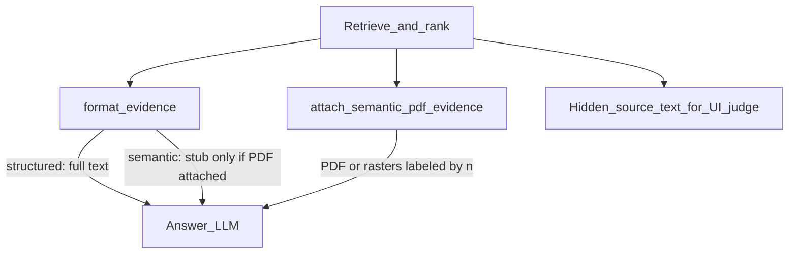

# ADR-0051: PDF-primary semantic evidence (stub pack)

## Status

Accepted. **Supersedes** [ADR-0050](0050-generate-hybrid-pdf-evidence.md)
**decision 2 only** (full `source_text` always in the fenced pack). Keeps
ADR-0050 decisions 1 (hybrid PDF/raster attach), 3 (structured full text),
and 4 (non-stream when PDF file parts are present).

## Context

ADR-0050 attached native PDF page-ranges (or rasters) **and** put the full
unit `source_text` in `<<<MANUFACTURER_EVIDENCE>>>`. That duplicated content
and biased the answer model toward the easier text channel, undermining the
reason for PDF attach (layout the extract loses).

## Target behavior

| Hit kind | What the answer LLM sees for `[n]` | Primary authority |
| --- | --- | --- |
| Structured | Full chunk text in the fence (`modality: structured_text`) | Text body |
| Semantic + PDF/raster OK | **Stub only** (label, pages, unit title/type, `modality: semantic_pdf`) + file/image part tagged `[n]` | Attachment |
| Semantic + attach failed | Full `source_text` in the fence (`modality: semantic_text_fallback`) | Text body |

Defaults locked with this ADR:

- Attach failure → **fallback to full `source_text` for that `[n]` only** (do not abstain the whole turn).
- Claim groundedness / `bench-qa` → score against **hidden** `source_text` on `Citation.block_text` (audit ledger). No multimodal judge in this slice.

## Decision

1. **Semantic + attach OK → stub in the fence, attachment is primary.** The
   fenced block for `[n]` is a locator stub (`modality: semantic_pdf`, pages,
   unit title/type, authority line). The answer LLM must quote/cite from the
   PDF or page images labeled `[n]`, not invent from the stub.
2. **Semantic + attach failed → full `source_text` for that `[n]` only.** Do
   not abstain the whole turn. Tag the block as text fallback.
3. **`source_text` remains the audit / UI / groundedness ledger.**
   `Citation.block_text` and claim scoring still use the full extract even
   when the prompt fence shows only a stub. No multimodal judge in this slice.
4. **Structured hits unchanged** — full chunk text with
   `modality: structured_text`. Pack-level `REPAIR_EVIDENCE_MAX_CHARS` and
   retrieval top‑N remain the size gates; budget math uses **stub length** for
   semantic-when-PDF so large extracts stop crowding out lower-ranked rows.
5. **Multimodal message is interleaved by retrieval rank.** After the evidence
   fence, each attached `[n]` is introduced with
   `Attachment for evidence [n]:` then the file or image part(s).
6. **Prompts rank across modalities.** Prefer lower `[n]` on conflict;
   `semantic_pdf` cites the attachment; `structured_text` cites the text block.

## Consequences

- Generate still uploads PDF slices / rasters when semantic units are cited.
- Claim groundedness rates stay comparable because the judge still sees hidden
  `source_text`.
- Prompt digests for `ask_system` / `diagnose_system` change with modality
  wording.

## See also

[architecture/04](../architecture/04-retrieval.md) ·
[architecture/05](../architecture/05-runtime-ask-diagnose.md) ·
[architecture/08](../architecture/08-semantic-curator-to-generate.md)
