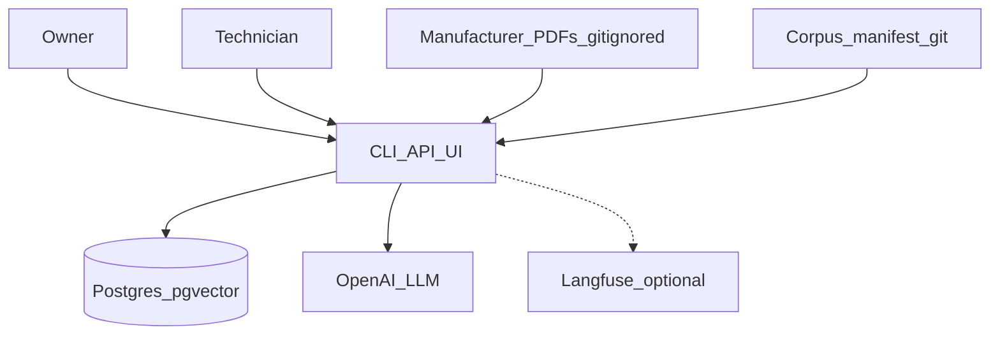
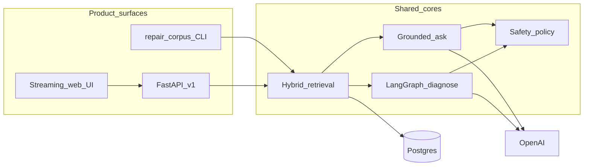
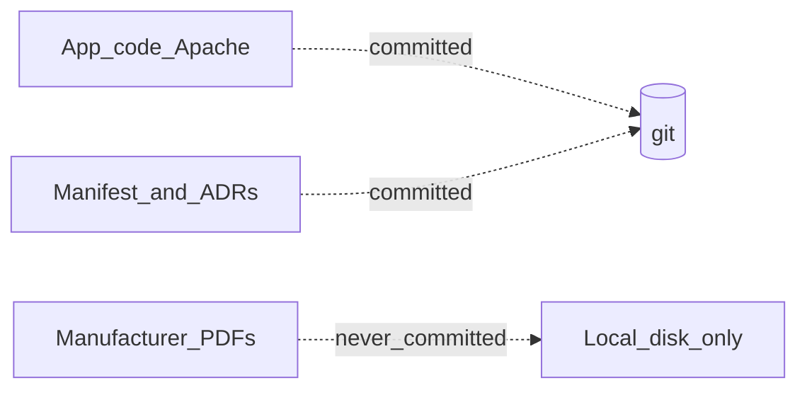

# 01 — System context

Who talks to what. Manufacturer PDFs stay on disk (gitignored); the committed
manifest describes them. OpenAI is used for LLM generation only — embeddings
are local BGE.

## Actors and boundaries

- **Audience matters:** Owner vs technician changes safety policy and (when feasible) which literature ranks first — same app, different gates.
- **Store:** Postgres + pgvector holds documents and chunk embeddings.
- **LLM:** OpenAI chat for ask / diagnose; never for embeddings ([ADR-0009](../adr/0009-local-open-embeddings.md)).
- **Corpus:** Manifest in git; bytes under `corpus/documents/` never committed ([ADR-0003](../adr/0003-no-downloader.md), [CORPUS_LICENSING](../CORPUS_LICENSING.md)).
- **Traces:** Langfuse is opt-in via `LANGFUSE_*` ([ADR-0018](../adr/0018-langfuse-observability.md)).

## Product surfaces

| Surface | Entry | Notes |
| --- | --- | --- |
| CLI | `search` / `ask` / `diagnose` | Same engines as API; good for benches |
| API | `POST /v1/ask`, `/v1/diagnose`, streams | Optional `X-API-Key` ([ADR-0016](../adr/0016-http-api-docker.md)) |
| UI | `http://localhost:8080/ui` | Ask / diagnose / search; export JSON/MD |

## Three-way copyright separation

Facts in the manifest (publication numbers, models, hashes) are reviewable in
diffs; the manuals that contain those facts stay local ([ADR-0005](../adr/0005-copyright-separation-and-licence.md)).

**Modules:** `api/`, `corpus/`, `ingest/`, `qa/`, `diagnostic/`, `safety/`, `observability/`
