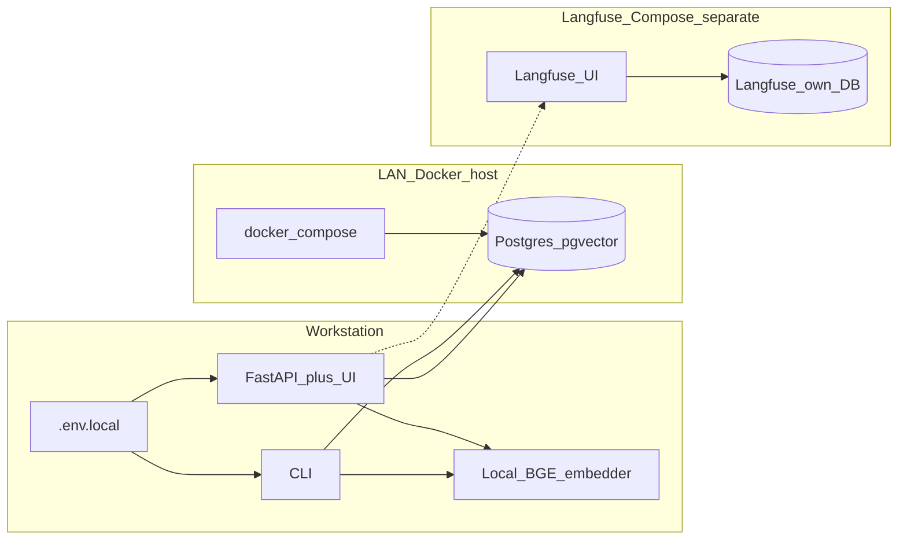
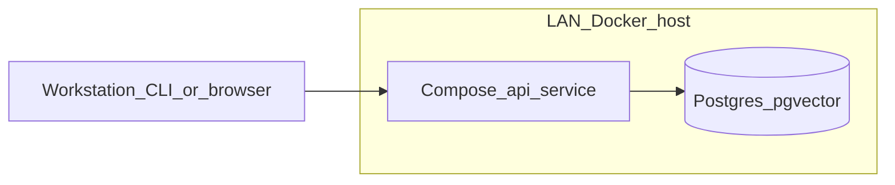
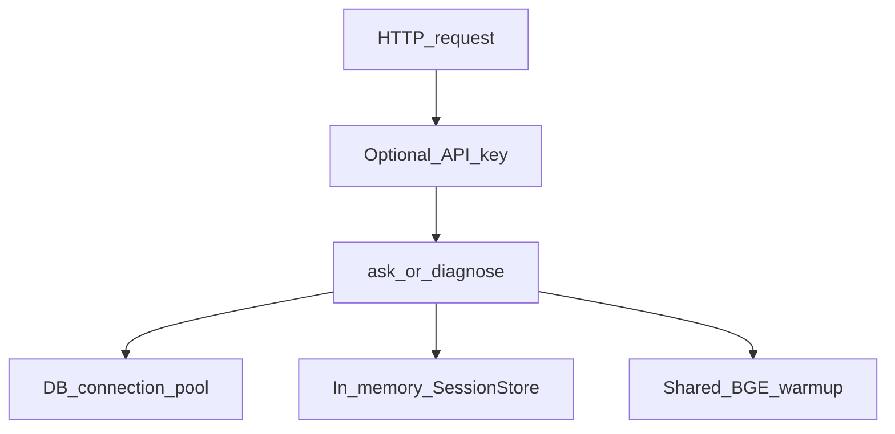

# 02 — Deployment

Default layout: app and local BGE embeddings on your workstation; Postgres on a
LAN Docker host. Langfuse (if used) is a separate Compose stack — not the repair DB.

## Default topology

- **Default:** `python -m repair_assistant.api.main` on the laptop; DB at `LAN_HOST:HOST_PORT` ([Deployment](../DEPLOYMENT.md), [ADR-0006](../adr/0006-lan-docker-host.md)).
- **Secrets:** Addresses and passwords live in gitignored `.env.local` / `INFRASTRUCTURE.local.md` — never in Compose committed defaults.
- **Constraint D8:** LAN-only; not internet-facing ([Charter](../CHARTER.md)).

## Optional API container

Same routes and shared DB; useful when you want the API always on the host.

- **Compose:** `docker/compose.yaml` `api` service builds `docker/Dockerfile` ([ADR-0016](../adr/0016-http-api-docker.md)).
- **Embedder:** Still local BGE inside the API process (shared warmup, pool, session TTL — [ADR-0021](../adr/0021-api-hardening-embedder-sessions.md)).

## Runtime concerns on the API box

| Concern | Behavior |
| --- | --- |
| DB pool | Sized / timed out via `REPAIR_DB_POOL_*`; 503 when exhausted |
| Diagnose sessions | In-memory; TTL + max sessions; not durable across restart |
| Streaming cancel | Client disconnect stops the generator (frees LLM/pool work) |
| Langfuse | Own stack — **never** point it at the repair `pgvector` DB ([LANGFUSE](../LANGFUSE.md)) |

**Ops docs:** [INFRASTRUCTURE](../INFRASTRUCTURE.md) · `docker/compose.yaml` · `.env.example`
