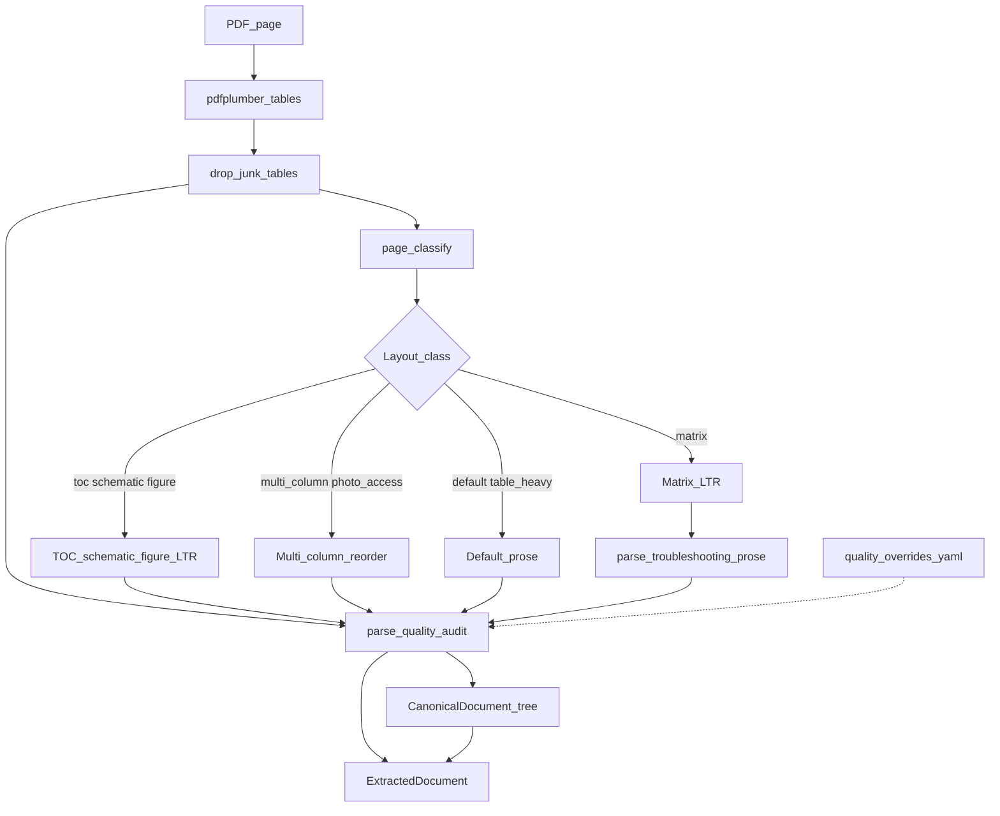
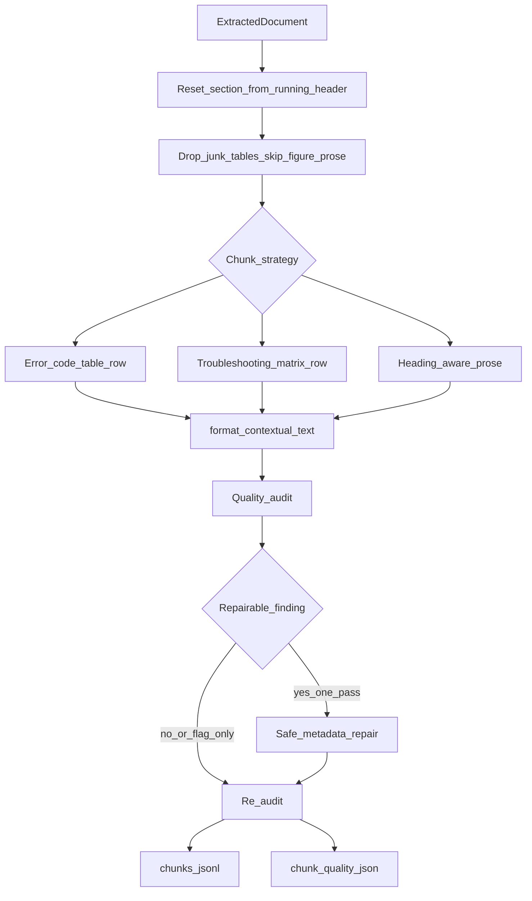
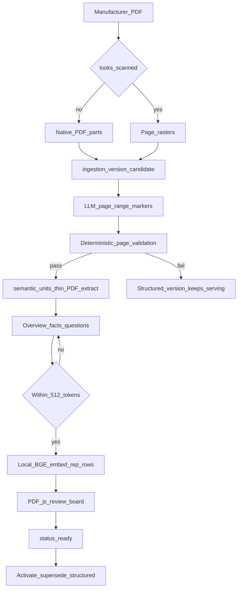

# 03 — Offline ingest

Build-time path from manufacturer files to searchable chunks. No downloader in
the repo — you acquire PDFs yourself, then `parse` → `ingest`.

This page has four views: **end-to-end**, **hybrid parse** (page-scoped router),
**chunking + bounded quality repair**, and the opt-in **semantic curator** path.

## End-to-end

- **Manifest first:** Identity, applicability, precedence, hashes ([ADR-0001](../adr/0001-corpus-manifest-format.md), [ADR-0004](../adr/0004-applicability-and-precedence.md)).
- **No fetch:** Verify-only tooling; PDFs never enter git ([ADR-0003](../adr/0003-no-downloader.md)).
- **Parse ≠ chunk:** Layout routing and table extraction are separate from RAG chunk boundaries ([ADR-0024](../adr/0024-hybrid-parse-architecture.md), [ADR-0007](../adr/0007-parser-and-chunker.md)).
- **Ingest:** Fingerprint skip for unchanged docs; local `BAAI/bge-base-en-v1.5` ([ADR-0008](../adr/0008-incremental-ingestion.md), [ADR-0009](../adr/0009-local-open-embeddings.md)).
- **Versioned output:** Every chunk belongs to an `ingestion_versions` row. `ingest` writes the document's `structured` version and refuses to overwrite a document whose active version is `semantic_llm` ([ADR-0047](../adr/0047-ingestion-versions.md)).

## Hybrid parse (per page)

Production `repair-corpus parse` uses the **hybrid** extractor — a page-scoped
router, not one PDF library for everything. Tables stay on pdfplumber; prose
reading order depends on layout class.

- **Classify:** `matrix` | `toc` | `schematic` | `figure` | `photo_access` | `table_heavy` | `multi_column` | `default` — wrong class breaks error tables or TEST # procedures ([ADR-0024](../adr/0024-hybrid-parse-architecture.md)). The layout-pack checklist is `evals/parsing/layout-pack.yaml` (`repair-corpus bench-layout`).
- **Tables:** `pdfplumber` `extract_tables()`, then drop artwork / warning-box grids — owns the `error-codes-bound` hard gate.
- **LTR pages:** `matrix`, `toc`, `schematic`, `figure` keep pdfplumber left-to-right text. Matrix vertical rules are table columns, not newspaper columns. Guide #1 / #2 rows rebuilt via `table_context.parse_troubleshooting_prose` when grids are missed.
- **Multi-column / photo-access:** Left-then-right / layout path for TEST # procedures and component-access pages with photos.
- **Audit:** Per-page reading-order and table-variance signals; config overrides in `config/parsing/quality_overrides.yaml`.
- **Output:** Backward-compatible `ExtractedDocument` plus optional `CanonicalDocument` tree with `parse_audit` JSON.

**Modules:** `parsing/hybrid.py`, `parsing/page_classify.py`, `parsing/parse_quality.py`, `parsing/canonical.py`, `parsing/table_context.py`

## Chunking and bounded quality repair

Chunk boundaries follow ADR-0007 (table-row / heading-aware prose). **Contextual
enrichment** adds doc title, section path, and headers into embed text. A
**single-pass** audit→repair→re-audit loop improves opaque rows without
re-parsing the PDF.

- **Structured splits:** One row per error-code / matrix data row; prose by heading — not fixed-size splits ([ADR-0007](../adr/0007-parser-and-chunker.md)).
- **Headings:** TOC dotted `TEST #` rows and note sentences are not section banners; each page resets `section_path` from the running header when present ([ADR-0022](../adr/0022-contextual-chunk-enrichment.md)).
- **Skip / drop:** Schematic and figure prose stay out of the index (keep real pin tables). Artwork and shock-box “tables” are dropped.
- **Matrix chunks:** Guide #1 (`problem_spanned`) and Guide #2 (`group_symptom`) inherit problem anchors and group notes in metadata + embed text ([ADR-0022](../adr/0022-contextual-chunk-enrichment.md)). Guide #1 anchors are OEM problem names in title case or ALL CAPS (`Door Won't Unlock`, `WON'T POWER UP`); cause sentences with a period are not anchors ([ADR-0042](../adr/0042-guide1-anchor-and-checklist-coalesce.md)).
- **Enrich:** `doc_title`, `section_path`, `Header: value` keyed rows so retrieval sees context, not bare numbers.
- **Self-improve:** `audit_and_improve` — at most **one** repair pass (`MAX_REPAIR_PASSES = 1`); flag-only findings (e.g. unbound error codes) never auto-merge; persists `chunk_quality.json` beside `chunks.jsonl`.
- **Offline only:** LLM header suggestions and re-parse never chain from live ask/diagnose.

**Modules:** `parsing/chunker.py`, `parsing/chunk_quality.py`, `parsing/write.py`

## Semantic curator (opt-in, per document)

Structured chunking above stays the default for every document. A document may
instead be **promoted** to `semantic_llm`, where an LLM proposes PDF page-range
markers (native PDF, or vision rasters when scanned), a human checks them on
the real PDF, and the new representation replaces the old one in a single
transaction
([ADR-0047](../adr/0047-ingestion-versions.md), [ADR-0049](../adr/0049-pdf-native-semantic-boundaries.md)).

- **PDF page markers, not parsed anchors:** The model returns `{start_page, end_page, start_y, end_y, title, unit_type}` over the PDF part it was given ([ADR-0049](../adr/0049-pdf-native-semantic-boundaries.md)).
- **Validation is the gate:** pages in bounds, ordered, no overlap, full window coverage. A failure leaves the candidate in place and the structured version serving traffic.
- **Unit vs representation:** `semantic_units.source_text` is a thin PDF extract of the page range (not hybrid-parse enrichment) and is what reaches the answer LLM. The searchable `chunks` rows are compact `overview` / `facts` / `questions` surfaces carrying `unit_id` + `rep_kind`. An over-budget representation is regenerated, then surfaced to the reviewer — never truncated. Empty extracts on scanned units block activate until OCR exists.
- **Cutover:** `approve` marks the version `ready`; `activate` flips it to `active` and supersedes the structured version in one transaction. `revert` activates the structured version again without re-parsing.
- **Key-free ingest:** `parse` and `ingest` never call OpenAI. Only `repair-corpus segment` and the review board do (charter [D9](../CHARTER.md#deviations-from-this-charter)).

**Modules:** `semantic/segment.py`, `semantic/pdf_extract.py`, `semantic/validate.py`, `semantic/units.py`, `semantic/representations.py`, `semantic/tokens.py`, `semantic/review.py`, `semantic/curate.py`, `semantic/lifecycle.py`, `semantic/store.py`

---

**CLI:** `repair-corpus parse` · `repair-corpus ingest` · `repair-corpus segment` · `repair-corpus ingestion-status` · `repair-corpus ingestion-revert` · `repair-corpus bench-layout` · [Reference corpus build](../REFERENCE_CORPUS_BUILD.md)
