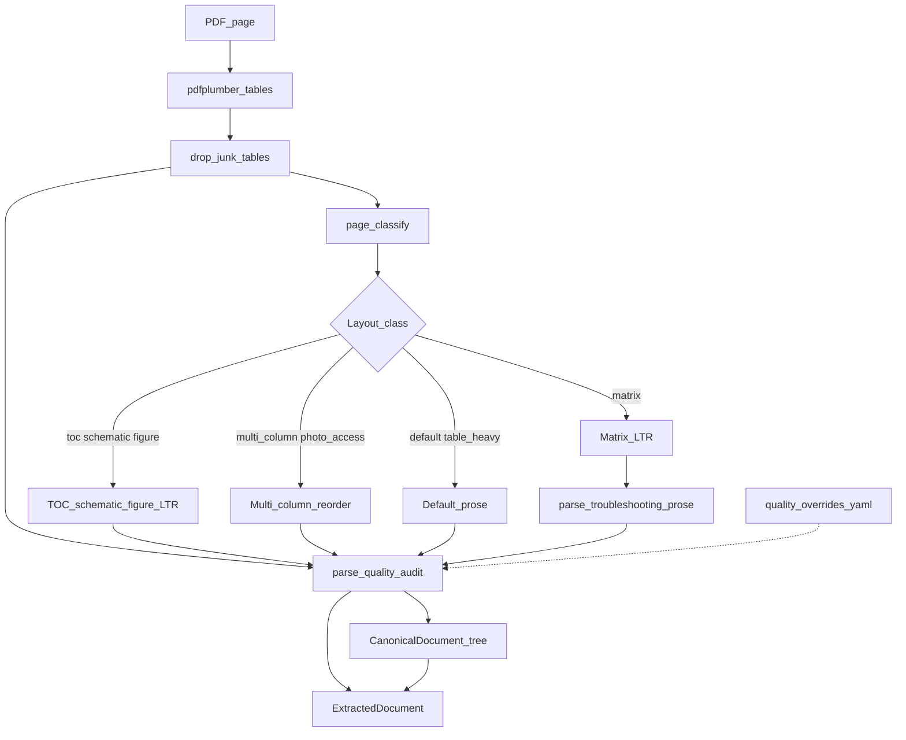
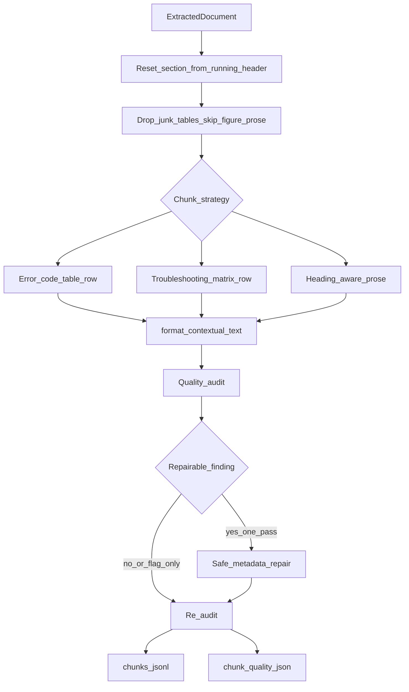

# 03 — Offline ingest

Build-time path from manufacturer files to searchable chunks. No downloader in
the repo — you acquire PDFs yourself, then `parse` → `ingest`.

This page has three views: **end-to-end**, **hybrid parse** (page-scoped router),
and **chunking + bounded quality repair**.

## End-to-end

- **Manifest first:** Identity, applicability, precedence, hashes ([ADR-0001](../adr/0001-corpus-manifest-format.md), [ADR-0004](../adr/0004-applicability-and-precedence.md)).
- **No fetch:** Verify-only tooling; PDFs never enter git ([ADR-0003](../adr/0003-no-downloader.md)).
- **Parse ≠ chunk:** Layout routing and table extraction are separate from RAG chunk boundaries ([ADR-0024](../adr/0024-hybrid-parse-architecture.md), [ADR-0007](../adr/0007-parser-and-chunker.md)).
- **Ingest:** Fingerprint skip for unchanged docs; local `BAAI/bge-base-en-v1.5` ([ADR-0008](../adr/0008-incremental-ingestion.md), [ADR-0009](../adr/0009-local-open-embeddings.md)).

## Hybrid parse (per page)

Production `repair-corpus parse` uses the **hybrid** extractor — a page-scoped
router, not one PDF library for everything. Tables stay on pdfplumber; prose
reading order depends on layout class.

- **Classify:** `matrix` | `toc` | `schematic` | `figure` | `photo_access` | `table_heavy` | `multi_column` | `default` — wrong class breaks error tables or TEST # procedures ([ADR-0024](../adr/0024-hybrid-parse-architecture.md)). The layout-pack checklist is `evals/parsing/layout-pack.yaml` (`repair-corpus bench-layout`).
- **Tables:** `pdfplumber` `extract_tables()`, then drop artwork / warning-box grids — owns the `error-codes-bound` hard gate.
- **LTR pages:** `matrix`, `toc`, `schematic`, `figure` keep pdfplumber left-to-right text. Matrix vertical rules are table columns, not newspaper columns. Guide #1 / #2 rows rebuilt via `table_context.parse_troubleshooting_prose` when grids are missed.
- **Multi-column / photo-access:** Left-then-right / layout path for TEST # procedures and component-access pages with photos.
- **Audit:** Per-page reading-order and table-variance signals; config overrides in `config/parsing/quality_overrides.yaml`.
- **Output:** Backward-compatible `ExtractedDocument` plus optional `CanonicalDocument` tree with `parse_audit` JSON.

**Modules:** `parsing/hybrid.py`, `parsing/page_classify.py`, `parsing/parse_quality.py`, `parsing/canonical.py`, `parsing/table_context.py`

## Chunking and bounded quality repair

Chunk boundaries follow ADR-0007 (table-row / heading-aware prose). **Contextual
enrichment** adds doc title, section path, and headers into embed text. A
**single-pass** audit→repair→re-audit loop improves opaque rows without
re-parsing the PDF.

- **Structured splits:** One row per error-code / matrix data row; prose by heading — not fixed-size splits ([ADR-0007](../adr/0007-parser-and-chunker.md)).
- **Headings:** TOC dotted `TEST #` rows and note sentences are not section banners; each page resets `section_path` from the running header when present ([ADR-0022](../adr/0022-contextual-chunk-enrichment.md)).
- **Skip / drop:** Schematic and figure prose stay out of the index (keep real pin tables). Artwork and shock-box “tables” are dropped.
- **Matrix chunks:** Guide #1 (`problem_spanned`) and Guide #2 (`group_symptom`) inherit problem anchors and group notes in metadata + embed text ([ADR-0022](../adr/0022-contextual-chunk-enrichment.md)).
- **Enrich:** `doc_title`, `section_path`, `Header: value` keyed rows so retrieval sees context, not bare numbers.
- **Self-improve:** `audit_and_improve` — at most **one** repair pass (`MAX_REPAIR_PASSES = 1`); flag-only findings (e.g. unbound error codes) never auto-merge; persists `chunk_quality.json` beside `chunks.jsonl`.
- **Offline only:** LLM header suggestions and re-parse never chain from live ask/diagnose.

**Modules:** `parsing/chunker.py`, `parsing/chunk_quality.py`, `parsing/write.py`

---

**CLI:** `repair-corpus parse` · `repair-corpus ingest` · `repair-corpus bench-layout` · [Reference corpus build](../REFERENCE_CORPUS_BUILD.md)
