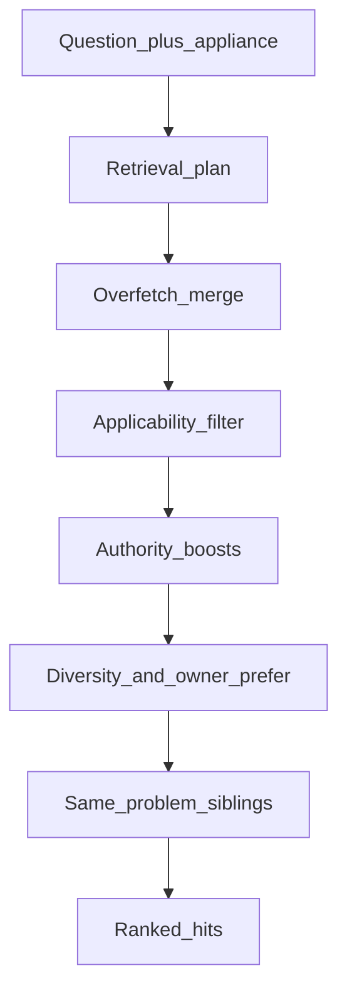
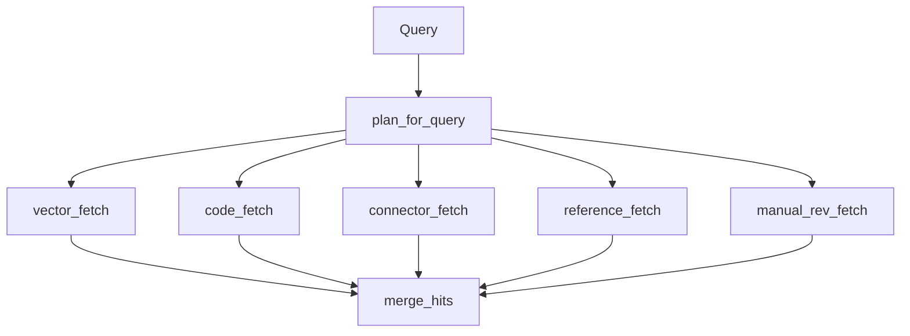
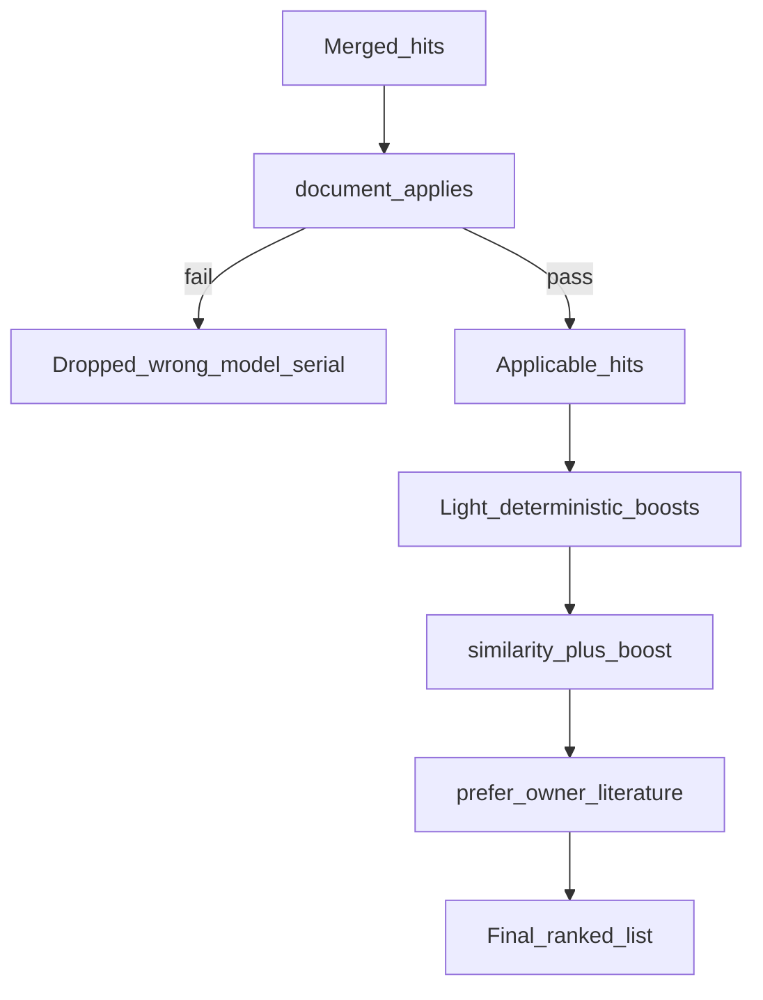

# 04 — Retrieval

Shared by ask and diagnose. Wrong-model / wrong-serial docs are dropped by
structured applicability before ranking — not left to embedding similarity alone.

## End-to-end

- **Same embedder as ingest:** Query vectors use local `BAAI/bge-base-en-v1.5` ([ADR-0009](../adr/0009-local-open-embeddings.md), [ADR-0010](../adr/0010-retrieval-applicability.md)).
- **One representation per document:** Every arm reads the `active_chunks` view, so only the document's active ingestion version is searchable. Superseded structured chunks stay in `chunks` but cannot be retrieved ([ADR-0047](../adr/0047-ingestion-versions.md)).
- **Over-fetch then drop:** Neighbours come back broad; applicability removes wrong-platform hits before boosts can resurrect them.
- **Product gate:** Hybrid re-test kept ADR-0010 as default ([ADR-0020](../adr/0020-hybrid-retrieval-retest.md)).

## Retrieval plan and fetch arms

Dense similarity alone is weak on short identifiers (F5E2, J36). The planner
extracts codes / connectors and fans out to exact arms, then merges.

| Arm | Role |
| --- | --- |
| `vector_fetch` | Cosine neighbours (`--overfetch`, default 40) |
| `code_fetch` | Error-code array overlap (`error_codes && …`) |
| `connector_fetch` | Exact connector IDs (e.g. J36) via text patterns |
| `reference_fetch` / `manual_rev_fetch` | Publication / revision-aware pulls when the plan asks |

On a `semantic_llm` document the arms match compact representations, not source
text (full path in [08 — Semantic curator → generate](08-semantic-curator-to-generate.md)).
After sibling coalesce, `collapse_semantic_units` groups hits by `unit_id`,
keeps the best score, records the matched `rep_kind`s in
`metadata.matched_representations`, and swaps `Hit.text` for the unit's own
`source_text` — so several representations of one procedure arrive as one piece
of evidence and generation reads the manual, not a generated summary
([ADR-0048](../adr/0048-semantic-knowledge-units.md), [ADR-0049](../adr/0049-pdf-native-semantic-boundaries.md)). This is the same
in-memory rewrite `coalesce_problem_hits` already performs: formatting, not a
new boost.

**Modules:** `retrieval/planner.py`, `retrieval/intent.py`, `retrieval/query_expand.py`, `retrieval/polarity.py`, `retrieval/search.py`, `retrieval/siblings.py`, `retrieval/units.py`. Door unlock/lock polarity is compositional (negation × lemma) after contraction fold ([ADR-0040](../adr/0040-door-polarity-grammar.md)). Unlock `add_to_search` is stuck-closed OEM only — no F5E2 / lock failure ([ADR-0041](../adr/0041-unlock-family-no-fault-code.md)). After rank, same-page `problem_title` siblings expand and coalesce into one evidence hit so `[n]` is the full on-page checklist — formatting, not a new boost ([ADR-0042](../adr/0042-guide1-anchor-and-checklist-coalesce.md)). Leftover idioms (`got locked`) live in [`config/retrieval/query_expand.yaml`](../../config/retrieval/query_expand.yaml). Do not grow contraction rows in `when_user_says`. Diagnose must not add unconstrained query rewrite ([ADR-0034](../adr/0034-diagnose-nlu-split.md), [ADR-0039](../adr/0039-diagnose-retrieve-labels.md)).

## Applicability, boosts, audience preference

- **Applicability:** Manifest model wildcards and serial ranges — e.g. 24-in TSP must not win for WFW5620HW0 ([ADR-0010](../adr/0010-retrieval-applicability.md), [ADR-0004](../adr/0004-applicability-and-precedence.md)).
- **Boosts (small):** Correcting / superseding edges, service-pointer tiers, error-code token overlap — reorder close candidates only.
- **Owner preference:** When audience is owner and any owner-facing hits remain, restrict to those — except identifier / technician-depth questions, which keep tech sheets and parts lists. If no owner-facing hit exists, keep service literature ([ADR-0020](../adr/0020-hybrid-retrieval-retest.md)).
- **Without `--model`:** Pure vector neighbours (dev/debug) — production ask/diagnose always pass appliance context.
- **Rerank bake-off:** `vector_apply_rerank` was measured and rejected ([ADR-0027](../adr/0027-cross-encoder-rerank.md)). Not wired into `search()`.

**Modules:** `retrieval/rank.py`, `corpus/applicability.py`. Bake-off rerank: `retrieval/rerank.py` (not on `search()`).
