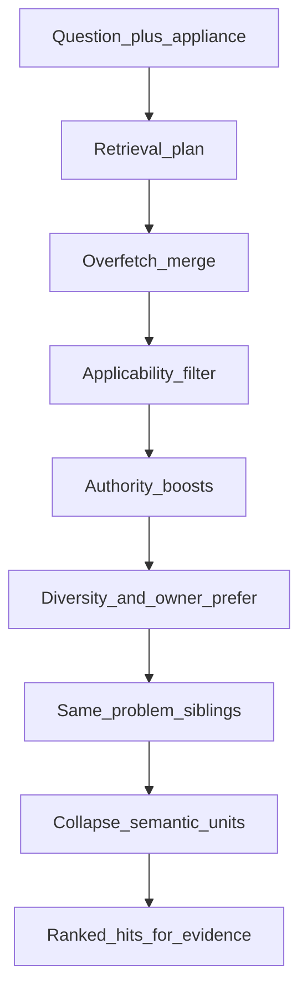
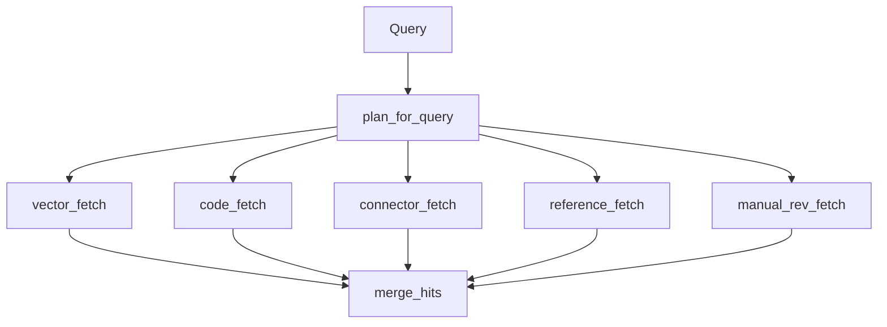
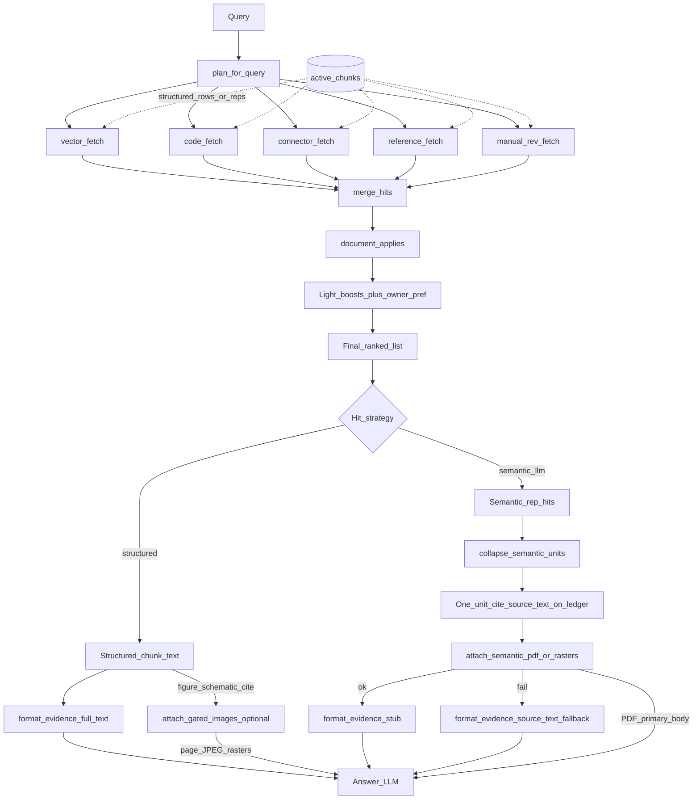
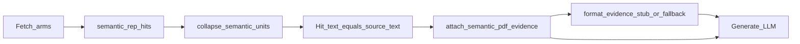
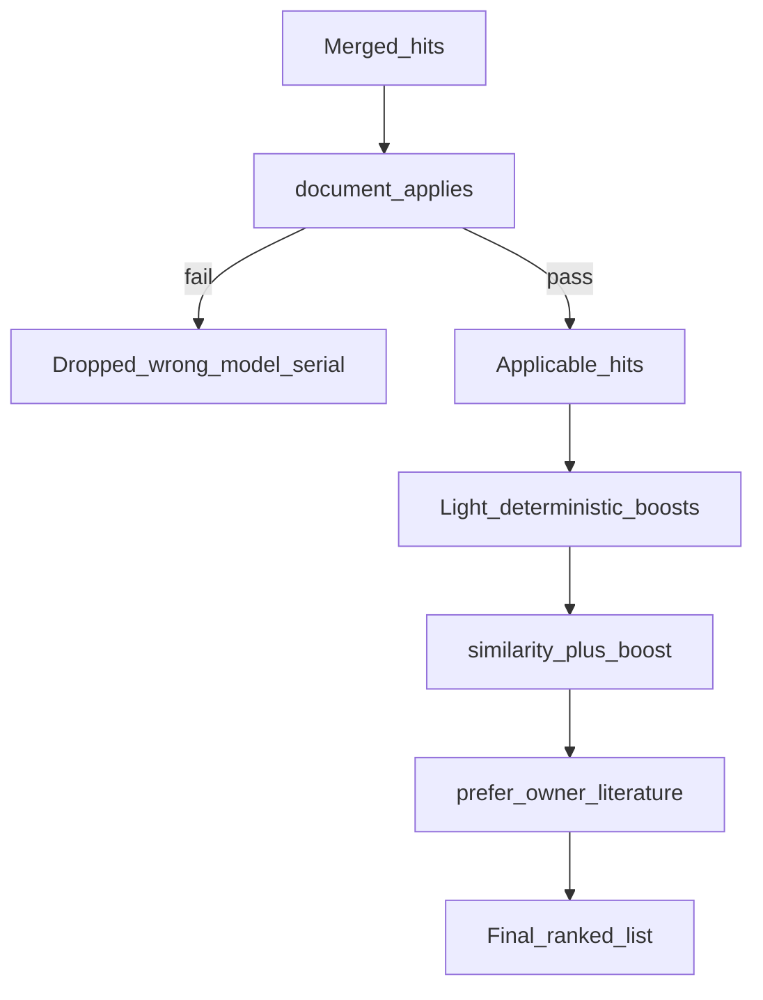

# 04 — Retrieval

Shared by ask and diagnose. Wrong-model / wrong-serial docs are dropped by
structured applicability before ranking — not left to embedding similarity alone.

Documents may be **structured** (default hybrid-parse chunks) or **semantic_llm**
(opt-in curated units). Both flow through the same arms and `active_chunks`
view; only the active ingestion version is searchable
([ADR-0047](../adr/0047-ingestion-versions.md)).

## End-to-end

- **Same embedder as ingest:** Query vectors use local `BAAI/bge-base-en-v1.5` ([ADR-0009](../adr/0009-local-open-embeddings.md), [ADR-0010](../adr/0010-retrieval-applicability.md)).
- **One representation per document:** Every arm reads the `active_chunks` view, so only the document's active ingestion version is searchable. Superseded structured chunks stay in `chunks` but cannot be retrieved ([ADR-0047](../adr/0047-ingestion-versions.md)).
- **Over-fetch then drop:** Neighbours come back broad; applicability removes wrong-platform hits before boosts can resurrect them.
- **Product gate:** Hybrid re-test kept ADR-0010 as default ([ADR-0020](../adr/0020-hybrid-retrieval-retest.md)).
- **Into generate:** Ranked hits become a numbered **text** evidence pack via `format_evidence`, then ask/diagnose call the LLM ([05 — Ask vs diagnose](05-runtime-ask-diagnose.md)). For semantic cites with a successful PDF/raster attach, the fence is a **locator stub** and the attachment is primary ([ADR-0051](../adr/0051-pdf-primary-semantic-evidence.md); attach mechanics [ADR-0050](../adr/0050-generate-hybrid-pdf-evidence.md)).
- **Weak pack gate (optional):** When `REPAIR_WEAK_EVIDENCE_MIN_SCORE` is set, ask and diagnose **search** turns abstain before the LLM if the pack is only weak cosine and has no precision-arm hit ([ADR-0052](../adr/0052-weak-evidence-abstain-gate.md)). Progress reuse skips the gate ([ADR-0043](../adr/0043-session-evidence-reuse.md)).

## Retrieval plan and fetch arms

Dense similarity alone is weak on short identifiers (F5E2, J36). The planner
extracts codes / connectors and fans out to exact arms, then merges.

| Arm | Role |
| --- | --- |
| `vector_fetch` | Cosine neighbours (`--overfetch`, default 40) |
| `code_fetch` | Error-code array overlap (`error_codes && …`) |
| `connector_fetch` | Exact connector IDs (e.g. J36) via text patterns |
| `reference_fetch` / `manual_rev_fetch` | Publication / revision-aware pulls when the plan asks |

### Structured vs curated semantic hits

Same fetch arms and the same ranking stack; different rows in `active_chunks`.
Compact reps are a **search surface only** — they never become the generate
payload. After rank, semantic hits collapse to one unit cite; generate then
attaches the native PDF page-range (ADR-0051) instead of sending those reps.

| Stage | Structured | `semantic_llm` |
| --- | --- | --- |
| What BGE / arms match | Enriched chunk text | Compact reps (`overview` / `facts` / `questions`) |
| Ranking | Shared: applicability → light boosts → owner pref (`vector_apply_boost`) | Same |
| After rank | Chunk stays as-is (plus same-problem coalesce) | Collapse reps → one unit cite; ledger keeps `source_text` |
| Generate payload | Full text in fence (`modality: structured_text`); **optional** gated page JPEGs for figure/schematic cites ([ADR-0035](../adr/0035-multimodal-figure-evidence.md)) | Stub in fence + **native PDF/rasters** as primary (`modality: semantic_pdf`) |

| Active strategy | What is embedded / matched | Text evidence pack (`format_evidence`) | Also at generate ([ADR-0050](../adr/0050-generate-hybrid-pdf-evidence.md) / [ADR-0051](../adr/0051-pdf-primary-semantic-evidence.md)) |
| --- | --- | --- | --- |
| `structured` (default) | Hybrid-parse chunk text (enriched) | Full chunk text (`modality: structured_text`) | Optional page JPEGs for figures / schematics (existing late-fusion path) |
| `semantic_llm` (opt-in) | Compact **reps** (`overview` / `facts` / `questions`), not the PDF bytes | After collapse: **stub** when PDF/raster attaches (`modality: semantic_pdf`); full **`source_text`** only on attach failure. Hidden `Citation.block_text` keeps the extract for UI/judge | **Native PDF page-range** file part (text PDFs) or page rasters (scanned) — primary authority when attach OK |

For semantic cites the answer LLM treats the PDF/raster attachment as the body;
the fenced stub is a locator. Retrieval itself never matches on native PDF bytes.

On a `semantic_llm` document the arms match compact representations, not
`source_text` and not native PDF. After sibling coalesce,
`collapse_semantic_units` groups hits by `unit_id`, keeps the best score,
records matched `rep_kind`s in `metadata.matched_reps`, and swaps
`Hit.text` for the unit's authoritative `source_text` — so several
reps of one procedure arrive as **one evidence cite**
([ADR-0048](../adr/0048-semantic-knowledge-units.md),
[ADR-0049](../adr/0049-pdf-native-semantic-boundaries.md)). Generate attaches
the curated page-range first, then packs a stub (or full extract on attach
failure) so the model ranks across text and PDF modalities
([ADR-0051](../adr/0051-pdf-primary-semantic-evidence.md)).

That collapse is formatting after rank (same idea as
`coalesce_problem_hits`), not a new boost. End-to-end curator → board →
activate → retrieve → generate:
[08 — Semantic curator → generate](08-semantic-curator-to-generate.md).

**Modules:** `retrieval/planner.py`, `retrieval/intent.py`, `retrieval/query_expand.py`, `retrieval/polarity.py`, `retrieval/search.py`, `retrieval/siblings.py`, `retrieval/units.py`. Door unlock/lock polarity is compositional (negation × lemma) after contraction fold ([ADR-0040](../adr/0040-door-polarity-grammar.md)). Unlock `add_to_search` is stuck-closed OEM only — no F5E2 / lock failure ([ADR-0041](../adr/0041-unlock-family-no-fault-code.md)). After rank, same-page `problem_title` siblings expand and coalesce into one evidence hit so `[n]` is the full on-page checklist — formatting, not a new boost ([ADR-0042](../adr/0042-guide1-anchor-and-checklist-coalesce.md)). Leftover idioms (`got locked`) live in [`config/retrieval/query_expand.yaml`](../../config/retrieval/query_expand.yaml). Do not grow contraction rows in `when_user_says`. Diagnose must not add unconstrained query rewrite ([ADR-0034](../adr/0034-diagnose-nlu-split.md), [ADR-0039](../adr/0039-diagnose-retrieve-labels.md)).

## Applicability, boosts, audience preference

- **Applicability:** Manifest model wildcards and serial ranges — e.g. 24-in TSP must not win for WFW5620HW0 ([ADR-0010](../adr/0010-retrieval-applicability.md), [ADR-0004](../adr/0004-applicability-and-precedence.md)).
- **Boosts (small):** Correcting / superseding edges, service-pointer tiers, error-code token overlap — reorder close candidates only.
- **Owner preference:** When audience is owner and any owner-facing hits remain, restrict to those — except identifier / technician-depth questions, which keep tech sheets and parts lists. If no owner-facing hit exists, keep service literature ([ADR-0020](../adr/0020-hybrid-retrieval-retest.md)).
- **Without `--model`:** Pure vector neighbours (dev/debug) — production ask/diagnose always pass appliance context.
- **Rerank bake-off:** `vector_apply_rerank` was measured and rejected ([ADR-0027](../adr/0027-cross-encoder-rerank.md)). Not wired into `search()`.

**Modules:** `retrieval/rank.py`, `corpus/applicability.py`. Bake-off rerank: `retrieval/rerank.py` (not on `search()`).
