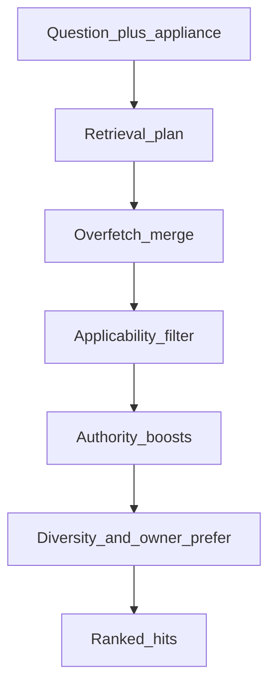
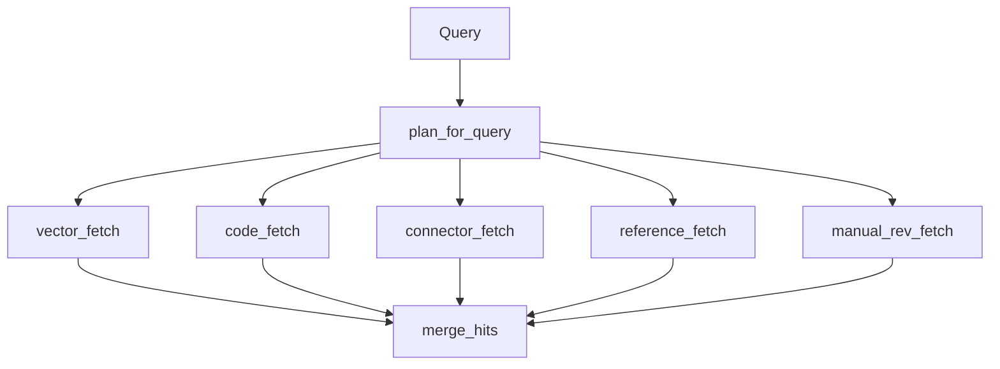
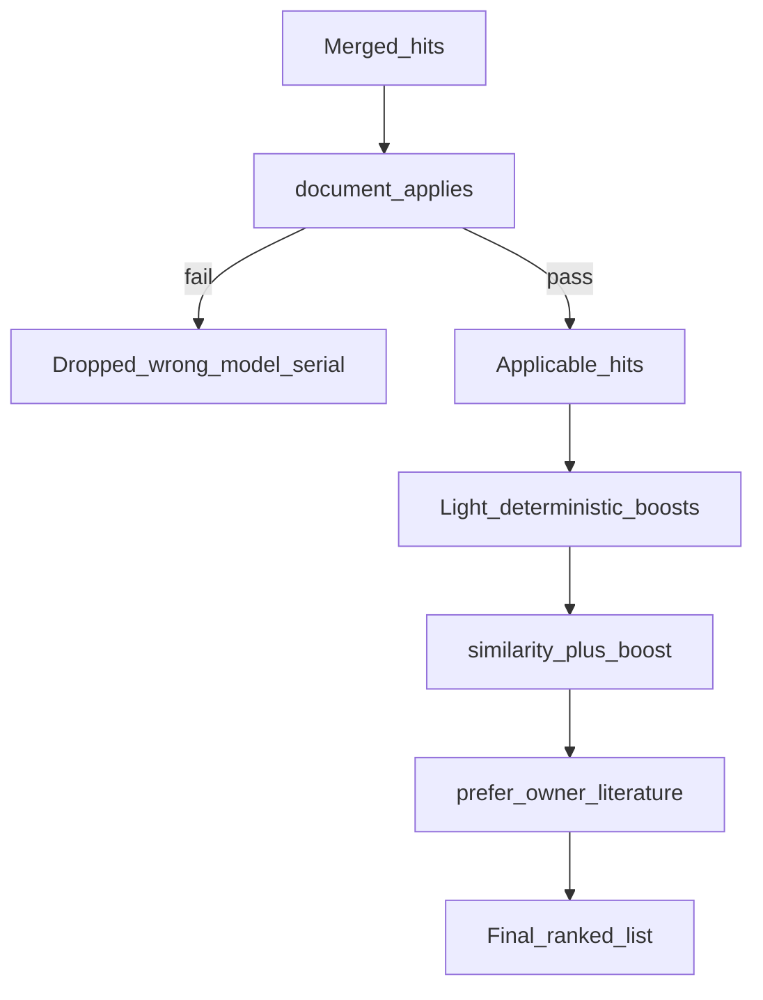

# 04 — Retrieval

Shared by ask and diagnose. Wrong-model / wrong-serial docs are dropped by
structured applicability before ranking — not left to embedding similarity alone.

## End-to-end

- **Same embedder as ingest:** Query vectors use local `BAAI/bge-base-en-v1.5` ([ADR-0009](../adr/0009-local-open-embeddings.md), [ADR-0010](../adr/0010-retrieval-applicability.md)).
- **Over-fetch then drop:** Neighbours come back broad; applicability removes wrong-platform hits before boosts can resurrect them.
- **Product gate:** Hybrid re-test kept ADR-0010 as default ([ADR-0020](../adr/0020-hybrid-retrieval-retest.md)).

## Retrieval plan and fetch arms

Dense similarity alone is weak on short identifiers (F5E2, J36). The planner
extracts codes / connectors and fans out to exact arms, then merges.

| Arm | Role |
| --- | --- |
| `vector_fetch` | Cosine neighbours (`--overfetch`, default 40) |
| `code_fetch` | Error-code array overlap (`error_codes && …`) |
| `connector_fetch` | Exact connector IDs (e.g. J36) via text patterns |
| `reference_fetch` / `manual_rev_fetch` | Publication / revision-aware pulls when the plan asks |

**Modules:** `retrieval/planner.py`, `retrieval/intent.py`, `retrieval/query_expand.py`, `retrieval/search.py`. Phrase lists live in [`config/retrieval/query_expand.yaml`](../../config/retrieval/query_expand.yaml) — Python only loads and matches. `when_user_says` is everyday wording; `add_to_search` must already appear in the literature. Do not treat the file as a growing slang dictionary.

## Applicability, boosts, audience preference

- **Applicability:** Manifest model wildcards and serial ranges — e.g. 24-in TSP must not win for WFW5620HW0 ([ADR-0010](../adr/0010-retrieval-applicability.md), [ADR-0004](../adr/0004-applicability-and-precedence.md)).
- **Boosts (small):** Correcting / superseding edges, service-pointer tiers, error-code token overlap — reorder close candidates only.
- **Owner preference:** When audience is owner and any owner-facing hits remain, restrict to those — except identifier / technician-depth questions, which keep tech sheets and parts lists. If no owner-facing hit exists, keep service literature ([ADR-0020](../adr/0020-hybrid-retrieval-retest.md)).
- **Without `--model`:** Pure vector neighbours (dev/debug) — production ask/diagnose always pass appliance context.
- **Rerank bake-off:** `vector_apply_rerank` was measured and rejected ([ADR-0027](../adr/0027-cross-encoder-rerank.md)). Not wired into `search()`.

**Modules:** `retrieval/rank.py`, `corpus/applicability.py`. Bake-off rerank: `retrieval/rerank.py` (not on `search()`).
