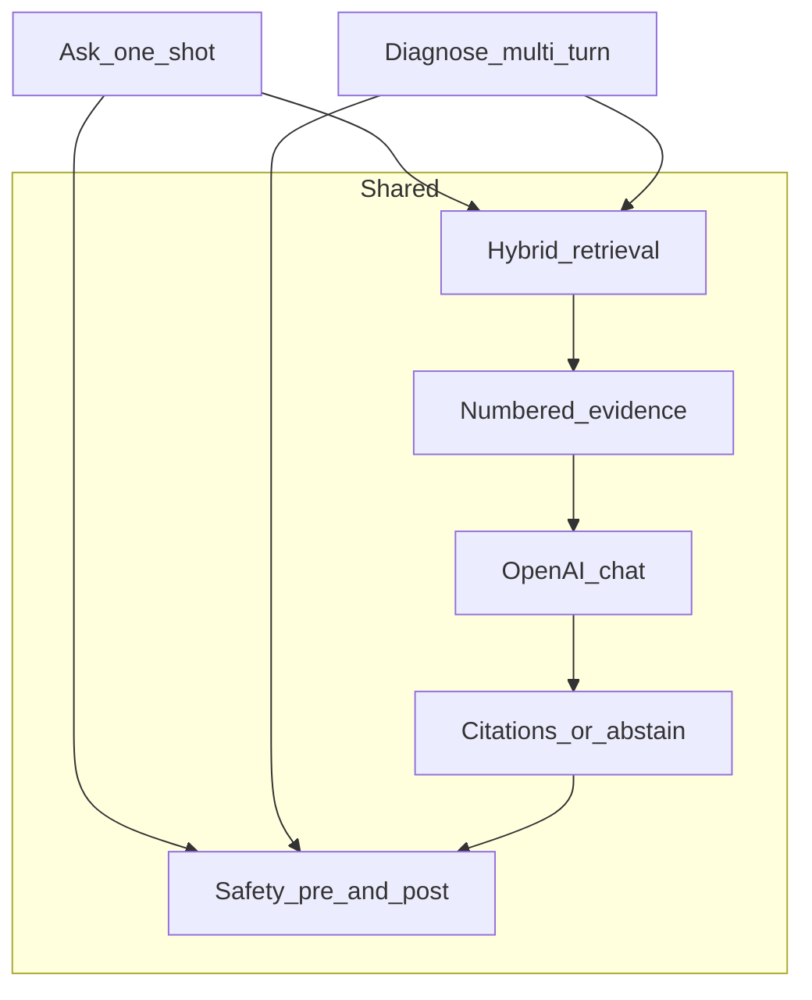
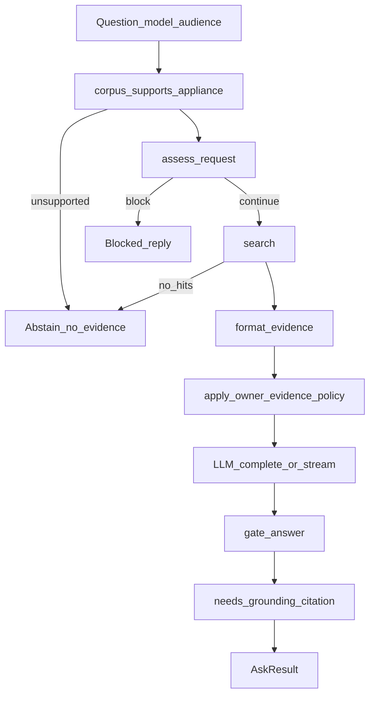
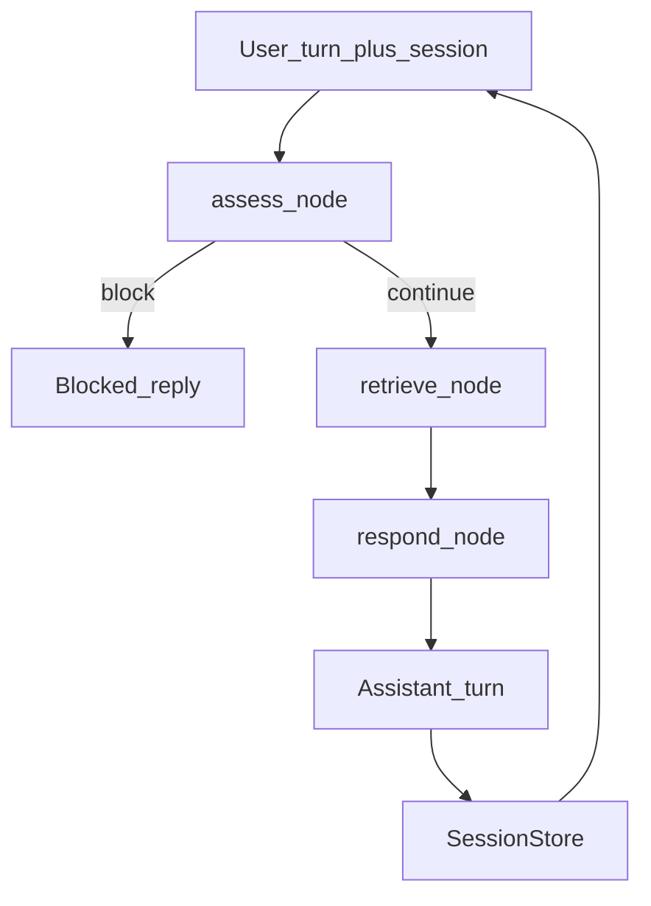

# 05 — Ask vs diagnose

Same retrieve → evidence → LLM → cite path. Ask is one-shot; diagnose is a
LangGraph multi-turn session with per-turn assess → retrieve → respond.

## Shared vs different

- Both paths call ADR-0010 `search()`, `format_evidence`, OpenAI, and safety gates.
- Diagnose adds session history, error-code carry-forward, and LangGraph node wiring.

## Ask (one-shot)

- **Abstain paths:** Unsupported model, no applicable evidence, or procedural answer missing `[n]` citations ([ADR-0012](../adr/0012-grounded-qa.md)).
- **Owner evidence policy:** Injects a directive when retrieved text looks like service-only literature so the model stays owner-safe.
- **Streaming:** SSE status / token / done events; disconnect cancels generation.
  The model returns structured JSON ([ADR-0028](../adr/0028-structured-claim-evidence.md));
  the client only sees the rendered `answer` after `gate_answer`.
- **Citations:** from `claims[].evidence_index`, with `[n]` in prose as fallback.
- **Groundedness:** `bench-qa` scores each claim against its evidence block
  ([ADR-0029](../adr/0029-claim-groundedness.md)). The judge sees those blocks.
- **Page images:** When a hit is a figure / schematic / photo-access page or
  cites a figure, and a vision-capable dated model is configured, attach up
  to three PDF page JPEGs at generate time ([ADR-0035](../adr/0035-late-fusion-page-images.md)).
  Retrieval stays BGE. Missing PDF keeps the unread-figure note. The same
  rasters are returned as `figure_pages` and served at
  `GET /v1/documents/{doc_id}/pages/{page}/image` so `/ui` can show the
  source page for cross-check ([ADR-0036](../adr/0036-ui-source-page-images.md)).
  Citations include that URL; `table_row` cites may also include a pdfplumber
  bbox so `/ui` can highlight the row ([ADR-0037](../adr/0037-table-row-highlight.md)).
  Prose-fallback matrix rows (no `find_tables()` grid) may union unique
  cause/check word-spans; a coalesced checklist copies page size from any
  sibling so the overlay still draws
  ([ADR-0038](../adr/0038-paragraph-highlight.md),
  [ADR-0042](../adr/0042-guide1-anchor-and-checklist-coalesce.md)).
  `prose` / `procedure` / `heading` cites get a box only when the body is a
  unique one-cluster word-span ([ADR-0038](../adr/0038-paragraph-highlight.md)).

**Modules:** `qa/generate.py`, `qa/context.py`, `qa/page_images.py`, `qa/structured.py`, `api/app.py`

## Diagnose (multi-turn LangGraph)

| Node | Responsibility |
| --- | --- |
| `assess` | Pre-LLM safety; block skips retrieve/LLM |
| `retrieve` | First turn / `new_symptom` / `mid_cycle_stop`: search + coalesce. `ack` / `still_unresolved` with a pack: **reuse** that evidence ([ADR-0043](../adr/0043-session-evidence-reuse.md)). Classify is label-only ([ADR-0039](../adr/0039-diagnose-retrieve-labels.md)); regex / `acks.py` fallback |
| `respond` | Multi-turn system prompt, citations, optional gated page images, post-LLM `gate_answer` |

- **State:** Messages, appliance, evidence, citation pool, abstain / escalate flags ([ADR-0013](../adr/0013-langgraph-diagnostic.md)), plus an inspectable board (`step`, `phase`, `hypotheses`, `ruled_out`, `observations`) that is merged each turn and injected into the prompt ([ADR-0031](../adr/0031-structured-diagnostic-state.md)). On an acknowledgement (classify `ack` / `still_unresolved`, or `acks.py`), merge also records the prior `next_check`, numbered checklist items (one per line or inline `1. … 2. …`), and `TEST #N` names as `ruled_out` when the model omits them. Do not restart a cleared category from its first remedy. A See TEST pointer may be named once; after the user confirms it, respond closes by rule — do not call generate to repeat that TEST.
- **NLU vs protocol:** Rules own the board, safety, applicability, and which OEM phrases may be appended. Turn 2+ classify returns a label only ([ADR-0039](../adr/0039-diagnose-retrieve-labels.md)). Progress follow-ups keep the last evidence pack so generate cannot hop books ([ADR-0043](../adr/0043-session-evidence-reuse.md)). Do not grow slang rows, a rule-only flowchart, or free query rewrite ([ADR-0034](../adr/0034-diagnose-nlu-split.md)). Regex / `acks.py` stay as fallback.
- **Session:** In-memory `SessionStore` with TTL and max sessions — not durable across API restart ([ADR-0021](../adr/0021-api-hardening-embedder-sessions.md)).
- **API:** `POST /v1/diagnose`, `/v1/diagnose/stream` with `session_id` ([ADR-0016](../adr/0016-http-api-docker.md)). JSON and the stream `done` event include a computed `tally` (symptom, cleared checks, next or closed, session citation chip) for `/ui` ([ADR-0044](../adr/0044-diagnose-session-tally.md)). The panel is read-only; it does not pick the next step.

**Modules:** `diagnostic/graph.py`, `diagnostic/session.py`, `diagnostic/state.py`

## Safety wiring

See [06 — Safety](06-safety.md) for policy detail. Ask and diagnose both run
`assess_request` before generation and `gate_answer` after.
