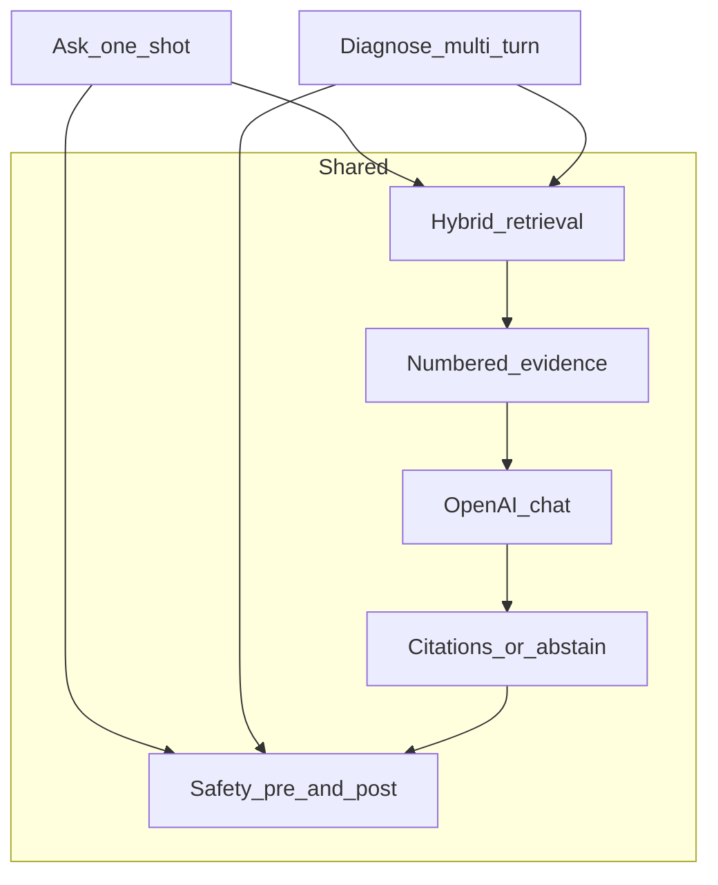
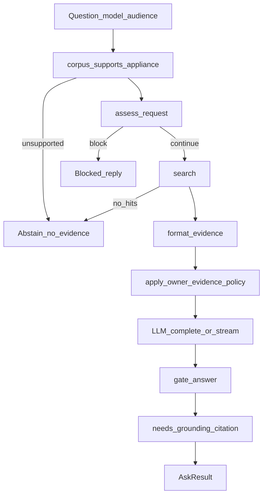
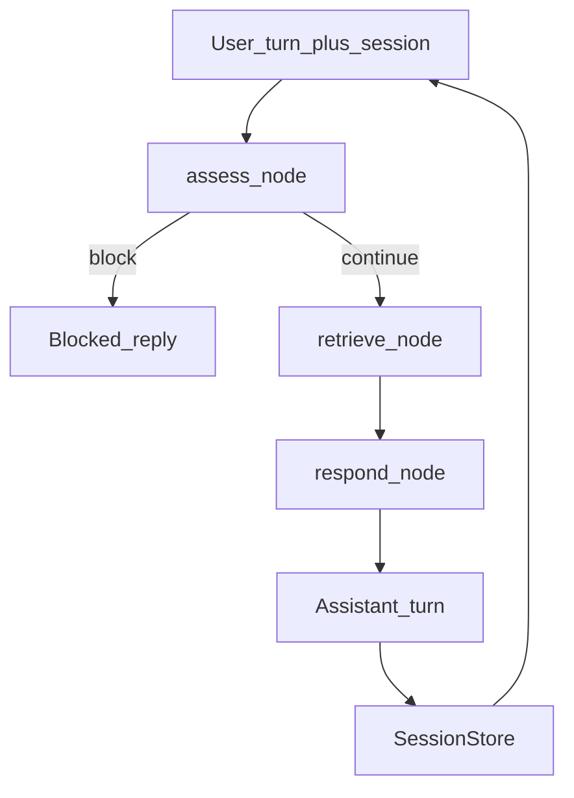

# 05 — Ask vs diagnose

Same retrieve → evidence → LLM → cite path. Ask is one-shot; diagnose is a
LangGraph multi-turn session with per-turn assess → retrieve → respond.

## Shared vs different

- Both paths call ADR-0010 `search()`, `format_evidence`, OpenAI, and safety gates.
- Diagnose adds session history, error-code carry-forward, and LangGraph node wiring.

## Ask (one-shot)

- **Abstain paths:** Unsupported model, no applicable evidence, or procedural answer missing `[n]` citations ([ADR-0012](../adr/0012-grounded-qa.md)).
- **Owner evidence policy:** Injects a directive when retrieved text looks like service-only literature so the model stays owner-safe.
- **Streaming:** SSE status / token / done events; disconnect cancels generation.
  The model returns structured JSON ([ADR-0028](../adr/0028-structured-claim-evidence.md));
  the client only sees the rendered `answer` after `gate_answer`.
- **Citations:** from `claims[].evidence_index`, with `[n]` in prose as fallback.
- **Groundedness:** `bench-qa` scores each claim against its evidence block
  ([ADR-0029](../adr/0029-claim-groundedness.md)). The judge sees those blocks.

**Modules:** `qa/generate.py`, `qa/context.py`, `qa/structured.py`, `api/app.py`

## Diagnose (multi-turn LangGraph)

| Node | Responsibility |
| --- | --- |
| `assess` | Pre-LLM safety; block skips retrieve/LLM |
| `retrieve` | `search()` on a built query: skip ack-only turns; if the latest turn is a mid-cycle / no-code stop and the session anchor is not, use that turn alone; else recent substantive user turns; prepend session error codes |
| `respond` | Multi-turn system prompt, citations, post-LLM `gate_answer` |

- **State:** Messages, appliance, evidence, citation pool, abstain / escalate flags ([ADR-0013](../adr/0013-langgraph-diagnostic.md)), plus an inspectable board (`step`, `phase`, `hypotheses`, `ruled_out`, `observations`) that is merged each turn and injected into the prompt ([ADR-0031](../adr/0031-structured-diagnostic-state.md)). On an acknowledgement, merge also records the prior `next_check` and numbered checklist lines as `ruled_out` when the model omits them.
- **Session:** In-memory `SessionStore` with TTL and max sessions — not durable across API restart ([ADR-0021](../adr/0021-api-hardening-embedder-sessions.md)).
- **API:** `POST /v1/diagnose`, `/v1/diagnose/stream` with `session_id` ([ADR-0016](../adr/0016-http-api-docker.md)).

**Modules:** `diagnostic/graph.py`, `diagnostic/session.py`, `diagnostic/state.py`

## Safety wiring

See [06 — Safety](06-safety.md) for policy detail. Ask and diagnose both run
`assess_request` before generation and `gate_answer` after.
