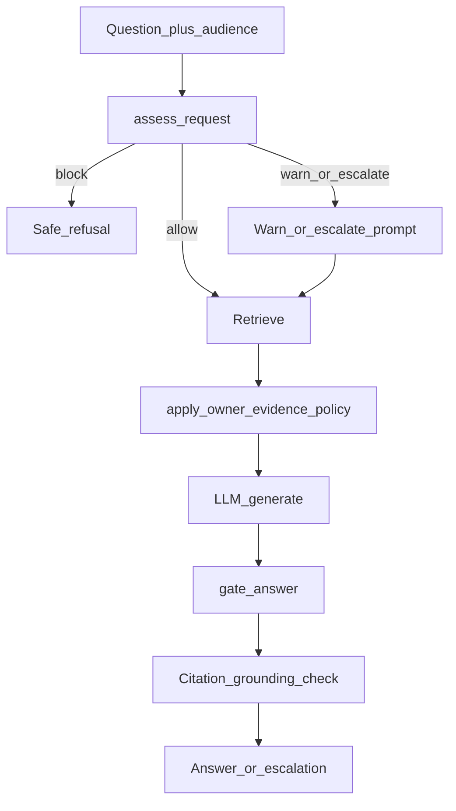
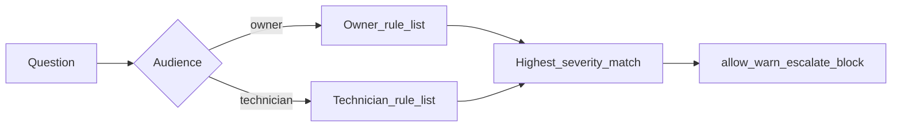
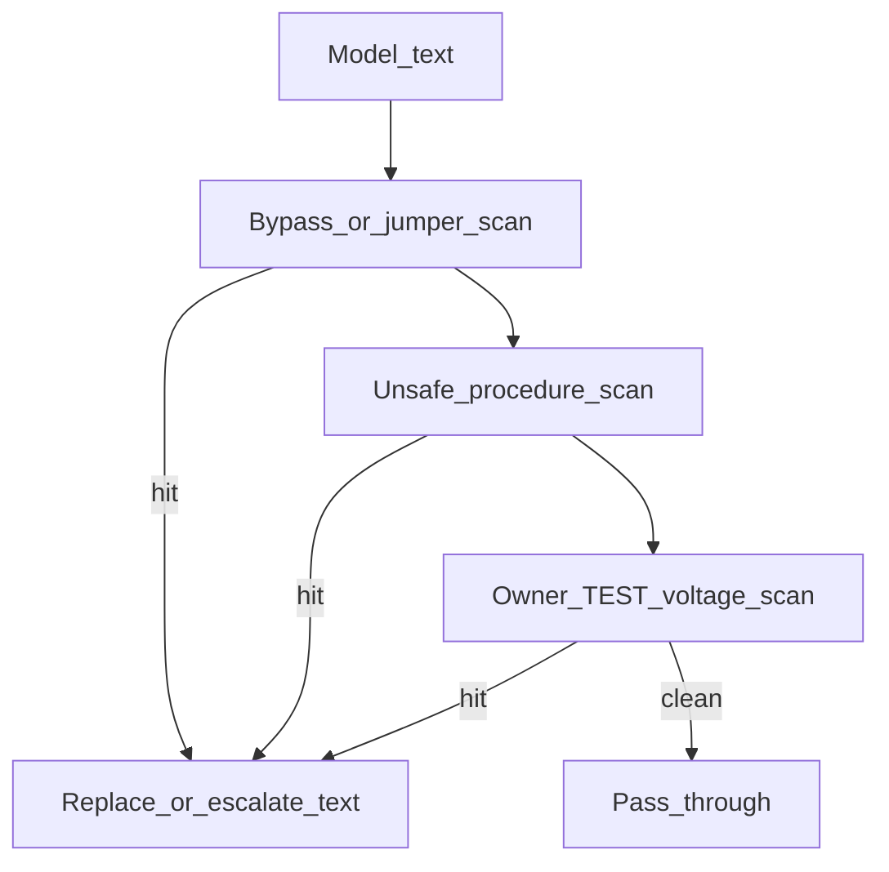

# 06 — Safety

Deterministic policy — not LLM-only. Pre-LLM assessment can block before
retrieval; warn/escalate inject prompt framing; post-LLM gate strips unsafe
procedures from generated text.

## End-to-end gates

- **Actions:** `allow` / `warn` / `escalate` / `block` ([ADR-0014](../adr/0014-safety-policy.md)).
- **Pre-LLM:** `block` skips the LLM with a fixed message; `warn` / `escalate` inject directives into the system prompt.
- **Post-LLM:** `gate_answer` strips bypass language and owner TEST # / live-voltage walkthroughs even if the model oversteps.
- **UX:** Sticky banner on block / escalate in `/ui`.

## Audience rule sets

| Audience | Typical outcomes |
| --- | --- |
| Owner | Escalate live voltage / panel / board work; block bypass / defeat-safety; prefer owner literature when present |
| Technician | Warn on live procedures; still **block** interlock bypass; broader TEST # access |

Rules are regex lists in `safety/policy.py` — maintainable fixtures, not an LLM judge. Graded by `repair-corpus bench-safety` without OpenAI or Postgres.

## Post-LLM gate (owner hard stops)

- **G1 — owner vs tech segregation:** `apply_owner_evidence_policy` + post-gate block of TEST # / voltage walkthroughs for owners.
- **G2 — expanded hazards:** Defeat safety, capacitor, tip-over, water-line mod, etc. (see `evals/safety/fixtures.yaml`).
- **G3 — citation grounding:** Procedural checklists without `[n]` citations abstain via `needs_grounding_citation`.

**Modules:** `safety/policy.py`, `safety/gate.py`, `safety/models.py` · bench: `evals/safety/fixtures.yaml`
