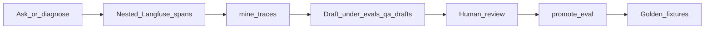
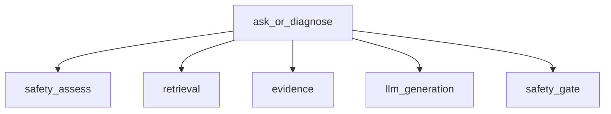
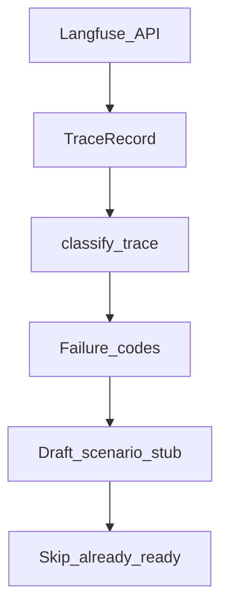

# 07 — Observability and improve

Optional Langfuse traces feed a human-reviewed eval mining loop. Tracing is not
required for CLI, UI, or manual benches.

## Improve loop

- **Opt-in:** Empty `LANGFUSE_*` keys → no-op tracing ([ADR-0018](../adr/0018-langfuse-observability.md), [LANGFUSE](../LANGFUSE.md)).
- **Governance:** What traces hold, optional serial redaction, retention, and deletion are documented in [LANGFUSE.md](../LANGFUSE.md#data-governance-review-r44) (review R44).
- **Mine:** `--write` only emits analysis under `evals/qa/drafts/` — no live fixture edits, no auto-promote ([ADR-0023](../adr/0023-trace-driven-eval-mining.md)).
- **Promote:** Human `promote-eval` only; golden fixtures stay under review.
- **Evals:** Layer benches remain the quality bar ([EVALS](../EVALS.md)).

## Nested span tree

When keys are set, each ask / diagnose turn produces nested observations:

| Span | Typical payload |
| --- | --- |
| `safety_assess` | Audience, action, reason |
| `retrieval` | Query, hit counts by arm, applicability drops |
| `evidence` | Numbered block sent to the LLM |
| `llm` | Messages in / completion out (generation) |
| `safety_gate` | Post-gate action / rewritten preview |

Traces also stamp `app_git_sha` / `app_started_at` so mined drafts can be tied to a build.

## Mine-traces classification

- **Failure codes** (examples): abstain / escalate patterns, procedural answer without citations, clarify-as-abstain — see `eval/mine_traces.py`.
- **Fingerprinting:** Normalized question + failure code avoids duplicate drafts.
- **Ready set:** Questions already covered by golden fixtures are skipped.

**Modules:** `observability/langfuse_tracing.py`, `observability/retrieval_trace.py`, `eval/mine_traces.py`, `eval/promote.py`
