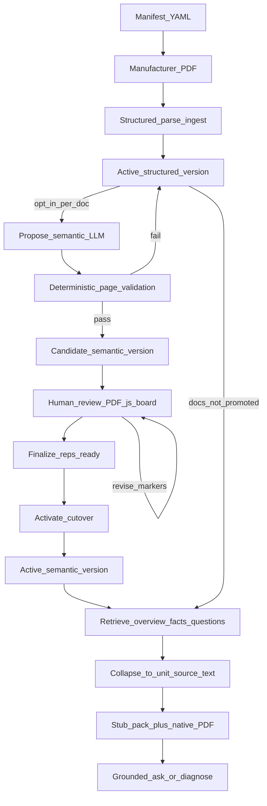
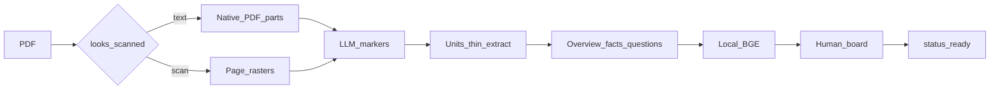
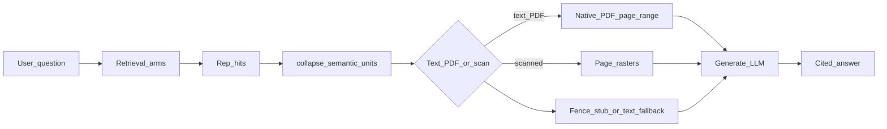

# 08 — Semantic curator through generate

End-to-end path for **opt-in LLM semantic chunking**: a capable model proposes
procedure-scale units on the manufacturer PDF, a human reviews markers on that
PDF, retrieval indexes compact representations, and generate sees a locator stub
plus native PDF layout as primary authority (full `source_text` on the citation
ledger). Structured hybrid parse remains the default for every document until
you promote one.

Drill-downs: curator offline detail in [03 — Offline ingest](03-offline-ingest.md);
retrieval collapse in [04 — Retrieval](04-retrieval.md); ask/diagnose runtime in
[05 — Ask vs diagnose](05-runtime-ask-diagnose.md). Decisions:
[ADR-0047](../adr/0047-ingestion-versions.md) ·
[ADR-0048](../adr/0048-semantic-knowledge-units.md) ·
[ADR-0049](../adr/0049-pdf-native-semantic-boundaries.md) ·
[ADR-0050](../adr/0050-generate-hybrid-pdf-evidence.md) ·
[ADR-0051](../adr/0051-pdf-primary-semantic-evidence.md).

## Why use a strong LLM up front

Repair manuals mix warnings, multi-page procedures, tables, and figures. Fixed
or hybrid-parse chunks optimize for **search recall**; they often split a TEST
procedure from its safety banner or flatten layout the technician sees.

Semantic curation flips the spend: use a **highly capable LLM once at corpus
build** (per high-risk document) to propose page-range units, then keep cheap
local BGE + a smaller generate model at query time. Humans gate cutover on the
real PDF so live retrieval never flips on unreviewed markers.

At answer time the model gets a **locator stub** plus the **native page-range
file part** (or page rasters when scanned) as primary authority; full
`source_text` stays on the citation for UI/claim-binding and as attach-failure
fallback ([ADR-0051](../adr/0051-pdf-primary-semantic-evidence.md)).

## End-to-end (corpus → human → generate)

- **Default path stays free of paid LLM calls:** `parse` / `ingest` only
  ([charter D9](../CHARTER.md#deviations-from-this-charter)).
- **Propose** needs `SEMANTIC_OPENAI_API_KEY`; review, finalize, activate, and
  revert do not.
- **One active version per `doc_id`:** activate supersedes structured in one
  transaction; revert restores structured without re-parse
  ([ADR-0047](../adr/0047-ingestion-versions.md)).
- **Board:** `/ui/corpus` — drag page-fraction handles, split/merge, approve
  units, Finalize (representations), Activate (cutover).

## Build-time detail (propose → ready)

Compact **representations** are what BGE indexes (512-token budget, regenerate
on overflow — never silent truncate). **`source_text`** is a thin PDF extract of
the approved page range — not hybrid-parse enrichment
([ADR-0048](../adr/0048-semantic-knowledge-units.md),
[ADR-0049](../adr/0049-pdf-native-semantic-boundaries.md)).

## Query-time detail (retrieve → generate)

- Retrieval still uses `active_chunks` and applicability; only the active
  version is searchable.
- Several reps of one unit become **one evidence cite** with the unit’s
  `source_text` on the citation ledger.
- Generate attaches layout first; the fence shows a stub when attach OK
  (full extract on failure). Structured hits send full chunk text (no 2k
  excerpt). Attachments are interleaved by `[n]` rank. Streaming falls back
  to complete when a PDF file part is present. Langfuse records
  `native_pdf_parts` for inspection
  ([ADR-0051](../adr/0051-pdf-primary-semantic-evidence.md),
  [ADR-0050](../adr/0050-generate-hybrid-pdf-evidence.md),
  [LANGFUSE.md](../LANGFUSE.md)).

What the answer LLM sees by hit kind (full table in
[ADR-0051](../adr/0051-pdf-primary-semantic-evidence.md)):

| Hit kind | Fence | Primary authority |
| --- | --- | --- |
| Structured | Full text | Text body |
| Semantic + attach OK | Locator stub | PDF / rasters for `[n]` |
| Semantic + attach failed | Full `source_text` | Text body |

## Surfaces

| Surface | Role |
| --- | --- |
| `repair-corpus segment` / `ingestion-status` / `ingestion-revert` | CLI propose and lifecycle |
| `http://localhost:8080/ui/corpus` | Human review board |
| `POST /v1/ask`, `/v1/diagnose` | Consume active units + PDF attach |
| Langfuse generate `llm` | Text pack + PDF media fingerprint |

**Modules:** `semantic/*`, `retrieval/units.py`, `qa/semantic_evidence.py`,
`api/corpus_routes.py`, `api/static/corpus.html`

## Review board (screenshots)

More context in the README
[Corpus review](../../README.md#corpus-review--semantic-markers) section.

